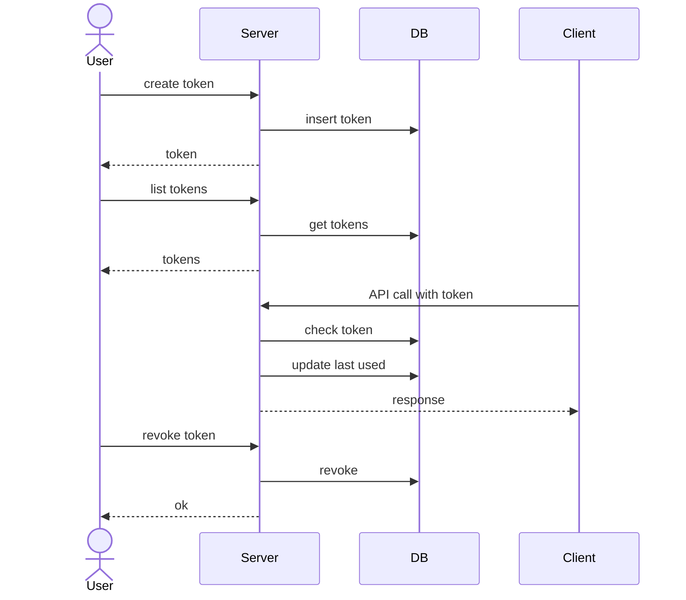

Tokens go in a new api_tokens table in Postgres. Hashed. Max 10, 90-day expiry, shown once.

```mermaid
sequenceDiagram
    actor User
    participant Server
    participant DB
    participant Client
    User->>Server: create token
    Server->>DB: insert token
    Server-->>User: token
    User->>Server: list tokens
    Server->>DB: get tokens
    Server-->>User: tokens
    Client->>Server: API call with token
    Server->>DB: check token
    Server->>DB: update last used
    Server-->>Client: response
    User->>Server: revoke token
    Server->>DB: revoke
    Server-->>User: ok
```

Errors return the usual 4xx codes.
